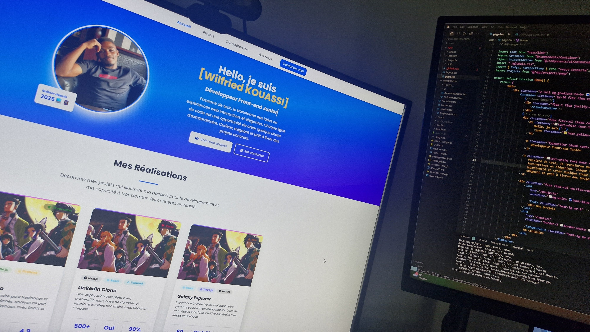

# 🌐 Portfolio – Wilfried KOUASSI

> Développeur Front-end en reconversion | React/Next.js | TypeScript

[](https://portfolio-wilfried-chi.vercel.app)

Bienvenue sur mon portfolio de développeur front-end, construit avec une stack moderne utilisée en entreprise.

Ce projet est ma vitrine technique : il regroupe mes clones de sites web, une mini-app mobile, un SaaS IA et d'autres projets innovants.

---

## 🚀 Stack utilisée

- **Next.js 15.3.2 (App Router)** - Framework React moderne
- **React 19.1.0** (via Next.js) - Bibliothèque UI
- **TypeScript 5** - Typage statique
- **Tailwind CSS 4.1.7** - Framework CSS utilitaire
- **Framer Motion** - Animations fluides
- **@fortawesome/fontawesome-free** - Icônes
- **lucide-react** / **react-icons** - Icônes modernes
- **react-circular-progressbar** - Visualisation
- **ESLint** - Linting du code
- **PostCSS** - Processing CSS
- **Git & GitHub** - Versioning
- **Vercel** - Déploiement continu

---

## 🧠 Objectifs du projet

- Présenter mes compétences en développement front-end (web, mobile, SaaS, IA)
- Servir de socle pour mes futures intégrations back-end (FastAPI)
- Préparer mon entrée sur le marché du travail (job ou mission freelance)
- Mettre en avant mon SaaS en cours : **EdgeMind** (coach IA pour traders)

---

## 📊 Statistiques du projet

| Indicateur       | Valeur                     | Description                               |
| ---------------- | -------------------------- | ----------------------------------------- |
| LIGNES           | x                          | Nombre total de lignes de code            |
| COMMITS          | x                          | Nombre de commits Git sur le projet       |
| TESTS            | x                          | Couverture ou nombre de tests automatisés |
| NOTE             | x                          | Note de satisfaction ou auto-évaluation   |
| UTILISATEURS     | 5+                         | Nombre d'utilisateurs/testeurs            |
| JOURS DE DEV     | 22j                        | Temps total de développement              |
| CONTRIBUTEURS    | 1                          | Nombre de contributeurs                   |
| MIS À JOUR       | 06/2025                    | Date de dernière mise à jour              |
| STACK            | React, Next.js, TypeScript | Principales technologies                  |
| LIBRAIRIES       | 12                         | Nombre de librairies/outils utilisés      |
| DÉPLOIEMENTS     | 10                         | Nombre de déploiements                    |
| VERSIONS         | v2.3                       | Numéro de version                         |
| DERNIER COMMIT   | 2025-06-05                 | Date du dernier commit                    |
| SCORE PERF       | 98/100                     | Score de performance Lighthouse           |
| COUVERTURE CI/CD | Oui                        | Intégration/déploiement continu           |
| VISITES          | 150+                       | Nombre de visites uniques                 |
| FEATURES         | 7                          | Nombre de fonctionnalités principales     |
| BUGS CORRIGÉS    | 23                         | Nombre de bugs/patchs réalisés            |
| PRODUCTION       | Oui                        | Projet déployé en production              |
| DOCS             | ✔️                         | Documentation technique rédigée           |

---

## 📄 Fonctionnalités

- Interface rapide, responsive et moderne
- Routing avec App Router (Next.js 15)
- Design utilitaire avec Tailwind CSS
- Animations fluides avec Framer Motion
- Layout global (`layout.tsx`)
- Configuration TypeScript stricte
- Linting avec ESLint
- Déploiement continu via GitHub + Vercel
- Sections : Accueil, Projets, Compétences, À propos, Contact, Merci

---

## 🔗 Démo en ligne

[](https://portfolio-wilfried-chi.vercel.app)

---

## 📂 Architecture du projet

```
/
├─ app/                    # Dossier principal Next.js (App Router)
│  ├─ layout.tsx          # Layout global
│  ├─ page.tsx            # Page d'accueil
│  ├─ projects/           # Page projets
│  ├─ skills/             # Page compétences
│  ├─ about/              # Page à propos
│  ├─ merci/              # Page de remerciement (contact)
│  └─ globals.css         # Styles globaux
│
├─ components/            # Composants React réutilisables
│  ├─ ui/                # Composants UI de base
│  ├─ ProjectCard.tsx    # Carte de projet
│  ├─ ProjectList.tsx    # Liste des projets
│  ├─ SkillsSection.tsx  # Section compétences
│  ├─ AboutSection.tsx   # Section à propos
│  ├─ ContactSection.tsx # Section contact
│  └─ ...                # Autres composants
│
├─ mock/                 # Données mockées
│  ├─ data/             # Données statiques
│  └─ types/            # Types TypeScript
│
├─ public/              # Ressources statiques
│  └─ images/          # Images du projet
│
├─ sandbox/             # Expérimentations et stats
│
├─ next.config.ts      # Configuration Next.js
├─ tailwind.config.js  # Configuration Tailwind
├─ tsconfig.json       # Configuration TypeScript
├─ postcss.config.js   # Configuration PostCSS
├─ eslint.config.mjs   # Configuration ESLint
├─ package.json        # Dépendances et scripts
└─ LICENSE            # Licence MIT
```

---

## 🧱 Projets principaux

### 🎨 Portfolio Builder

- **Description** : Vitrine interactive de mes compétences, clones (LinkedIn, Twitch), SaaS EdgeMind, mini-apps, etc. Responsive, animations Framer Motion, Next.js, Tailwind, TypeScript.
- **Stack** : React, Next.js, TypeScript, Tailwind CSS, Framer Motion
- [Voir en ligne](https://portfolio-wilfried-chi.vercel.app/) | [Code source](https://github.com/WilfriedFahim/portfolio-wilfried)
- **Statut** : Production

### 🧠 EdgeMind (SaaS trading IA)

- **Description** : Plateforme SaaS de coaching mental assistée par IA pour traders : analyse comportementale, mentor IA, suivi des performances.
- **Stack** : React, Next.js, TypeScript, Tailwind CSS, Framer Motion, Python, FastAPI
- [Voir en ligne](https://edgemind.app/)
- **Statut** : Beta, En construction

### 📱 Portfolio Mobile

- **Description** : Version mobile dédiée, navigation simplifiée, design épuré, animations adaptées, accessibilité renforcée.
- **Stack** : React Native, Expo, TypeScript, Tailwind CSS
- [Code source](https://github.com/WilfriedFahim/portfolio-mobile)
- **Statut** : En développement

### 🌍 Yamo

- **Description** : Application mobile pour localiser en temps réel la pharmacie la plus proche et ouverte en Afrique.
- **Stack** : React Native, Expo, TypeScript, Tailwind CSS
- **Statut** : Prochainement

### 🚗 CarEasy

- **Description** : Application mobile pour simplifier les déplacements en Afrique, mobilité urbaine et interurbaine.
- **Stack** : React Native, Expo, TypeScript, Tailwind CSS
- **Statut** : Prochainement

### 📺 Youtube Clone

- **Description** : Clone complet de Youtube : authentification, feed dynamique, profils, messagerie, notifications.
- **Stack** : Next.js, React, Tailwind CSS, Firebase, TypeScript
- [Code source](https://github.com/WilfriedFahim/linkedin-clone)
- **Statut** : Prochainement

---

## 🙋‍♂️ À propos

[](https://github.com/WilfriedFahim)

Je suis développeur front-end en reconversion, formé en autodidacte, passionné par la création de solutions concrètes et innovantes. Mon esprit « builder » me pousse à explorer le web, le mobile, le SaaS et l'IA, avec une forte culture produit.

- 🎯 **Objectif** : décrocher une première mission ou un poste front-end (React/Next.js)
- 🧱 **Projet phare** : EdgeMind – un dashboard pour traders avec logique IA

---

## 🧰 Scripts utiles

| Commande        | Description                        |
| --------------- | ---------------------------------- |
| `npm run dev`   | Lancer le serveur en développement |
| `npm run build` | Créer le build de production       |
| `npm run start` | Lancer l'app en mode production    |
| `npm run lint`  | Vérifier le code avec ESLint       |

---

## 📝 Prochaines étapes

1. Finalisation des tests unitaires
2. Amélioration des animations et de l'accessibilité
3. Mise en route des autres projets (Portfolio Mobile, Yamo, CarEasy)

---

## 📄 License

Ce projet est sous licence [MIT](LICENSE).
